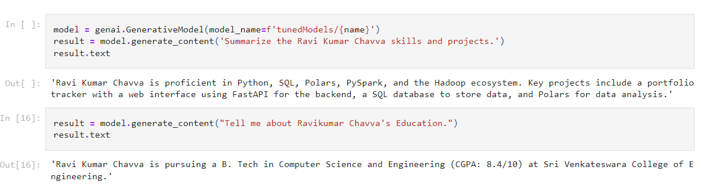

# Gemini Chat Bot

This project uses the Gemini API to fine-tune a model to learn about Ravi Kumar Chavva. The model is trained with various data points from Ravi's resume, projects, skills, education, and achievements.

## Overview

The Gemini API is utilized to create a tuned model that can understand and generate responses based on Ravi's professional background. The training data includes detailed information about Ravi's projects, skills, education, and achievements.

## Training Data

The training data consists of multiple entries, each containing a `text_input` and an `output`. The `text_input` provides a prompt related to Ravi's background, and the `output` is the expected response. Here are some examples:

- **Summarize the resume**:
  - **Input**: "Summarize the following resume: Ravi Kumar Chavva, B. Tech in Computer Science and Engineering, CGPA 8.4/10. Skills: Python, TypeScript, TensorFlow, FastAPI. Projects: Customer Churn Prediction (86% recall with FastAPI deployment), Car Price Prediction (85% adjusted R²), IPL Score Prediction (92% accuracy)."
  - **Output**: "Ravi Kumar Chavva, B. Tech in CSE (8.4 CGPA). Proficient in Python, TypeScript, TensorFlow, and FastAPI. Key projects: churn prediction (86% recall), car price prediction (85% R²), and IPL score prediction (92% accuracy)."

- **Rephrase a statement**:
  - **Input**: "Rephrase: Ravi led the Data Nexus association at his college, organizing workshops and peer sessions to accelerate data science learning among students."
  - **Output**: "As the founder of Data Nexus, Ravi enhanced data science education by hosting workshops and collaborative learning sessions."

- **List technical skills**:
  - **Input**: "List Ravi's technical skills."
  - **Output**: "Programming: Python, C, TypeScript. ML/Deep Learning: Scikit-learn, TensorFlow, PyTorch. Data Analysis: SQL, Polars, PySpark. Cloud: Azure, GCP. DevOps: FastAPI, Docker, GitHub Actions."

## Model Training

The model is trained using the following parameters:
- **Epoch Count**: 100
- **Batch Size**: 4
- **Learning Rate**: 0.001

## Results

The fine-tuned model can generate accurate and concise responses based on the provided training data. The results are showcased in the accompanying image, demonstrating the model's ability to understand and articulate Ravi's professional background effectively.

## Usage

To use this model, you can integrate it with your applications to generate responses related to Ravi Kumar Chavva's resume and professional background. The model can be queried with various prompts to obtain detailed and relevant information.

## Conclusion

This project demonstrates the capability of the Gemini API to fine-tune a model for specific use cases. By training the model with comprehensive data about Ravi Kumar Chavva, we have created a tool that can provide insightful and accurate responses about his professional journey.

For more information, visit Ravi's [Portfolio](https://ravikumarchavva.com) or [GitHub](https://github.com/ravikumarchavva/).
